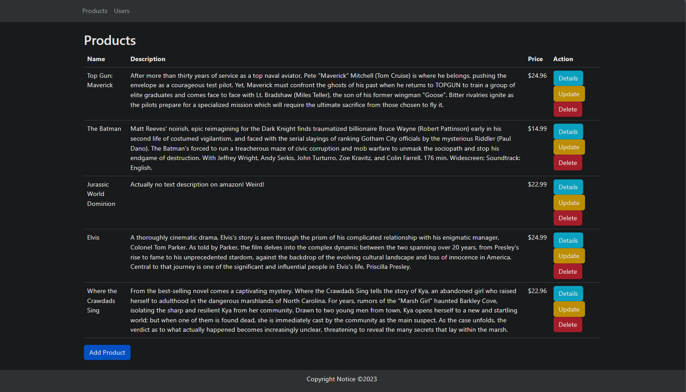
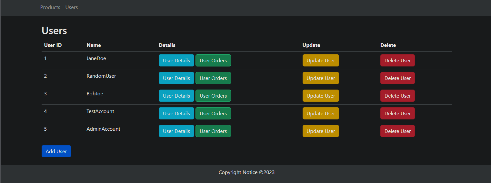

# Bootstrap CRUD App

This is a simple CRUD (Create, Read, Update, Delete) application built with PHP and Bootstrap.  
It allows users to manage records with an easy-to-use interface.

- User-friendly interface with Bootstrap styling
- Full Create-Read-Update-Delete functionality  
- Responsive design for mobile and desktop  
- PHP backend

## Screenshots

  

